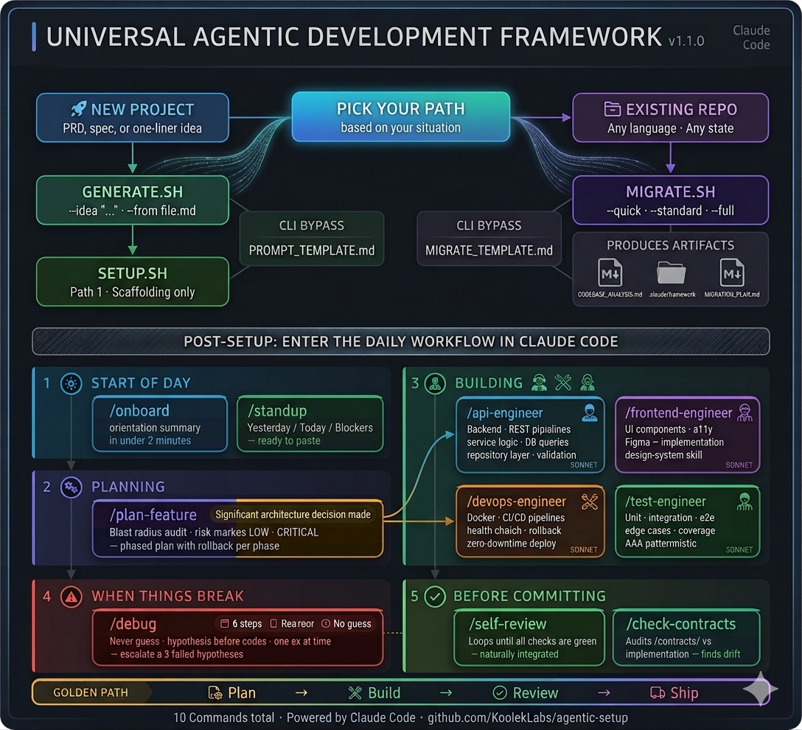
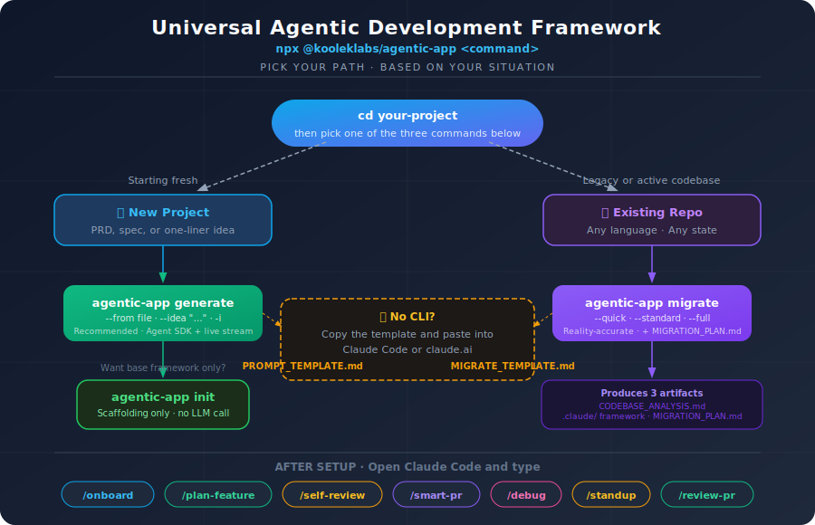
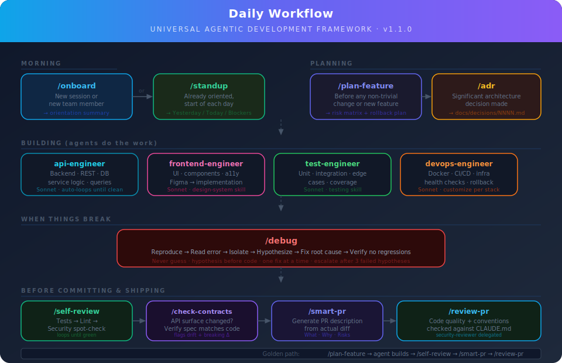

<div align="center">

# Universal Agentic Development Framework

**Drop into any project — one command installs an agent-ready workspace for Claude Code and GitHub Copilot CLI.**

[](https://www.npmjs.com/package/@kooleklabs/agentic-app)
[](./LICENSE)
[](https://docs.claude.com/en/docs/claude-code)
[](https://docs.github.com/copilot/concepts/agents/about-copilot-cli)
[](https://github.com/kooleklabs/agentic-setup/actions/workflows/ci.yml)
[](./CONTRIBUTING.md)

[Quick start](#-quick-start) •
[What you'll see](#-what-youll-see) •
[Commands](#-commands) •
[Interactive mode](#-interactive-mode) •
[Cost tracking](#-cost-tracking) •
[Daily workflow](#-daily-workflow) •
[Roadmap](#-roadmap) •
[FAQ](#-faq)

</div>

---

## What's New

<details>
<summary><b>v3.1 — Plan → Implementation Pass</b> <code>🚧 In Progress</code></summary>

`github-sync --execute` closes the final gap in the GitHub-native loop: it reads a reviewed-and-merged plan and runs a full implementation pass on a fresh `impl/<slug>` branch, ready for human review and PR.

**Also shipping in v3.1:**
- `--yes` / `-y` on both `push-architecture` and `github-sync` — skip the confirmation prompt for CI and scripted flows
- Smart `--base` auto-detection via `gh repo view` — no more hardcoded `main`

</details>

<details>
<summary><b>v3.0 — GitHub-Native Automation</b> <code>✅ Shipped 2026-04-17</code></summary>

- `push-architecture` — parses `docs/architecture.md` and creates GitHub Milestones + one Issue per feature in one shot
- `github-sync --issue N` — turns any feature Issue into a reviewed implementation plan (draft PR + Issue comment)
- Idempotent re-runs, `--dry-run`, `--force`, `--ready`, `--no-comment`, `--yes` flags

</details>

<details>
<summary><b>v2.6 — Architecture Design Gate</b> <code>✅ Shipped 2026-04-16</code></summary>

After `generate`, an architect agent automatically produces a full system design before any feature code is written: ERD, real OpenAPI contract, ADRs, and domain skills.

</details>

---

## Overview

A batteries-included framework that turns **any codebase into an agent-ready workspace**. It ships the scaffolding — agents, skills, commands, hooks, and guardrails — so Claude Code or GitHub Copilot CLI can plan, build, test, and review alongside you from day one.

|  |  |
|---|---|
| **One command** | `npx @kooleklabs/agentic-app generate --from proposal.docx` — that's the whole install |
| **Universal** | Any stack — Next.js, Go, Laravel, Rails, Django, FastAPI, Rust, anything |
| **Multi-agent** | Works with Claude Code, Copilot CLI, or both — use `--target` to choose |
| **Greenfield or legacy** | New project or 10-year-old codebase, both are first-class via `generate` / `migrate` |
| **Autonomous or guided** | Default: agent makes reasonable choices. `--interactive` pauses for clarification |
| **Cost-aware** | Every run ends with token counts + USD estimate |
| **Tested + linted** | Jest covers `lib/`, ESLint enforces style, CI gates every PR (v2.5+) |
| **Transparent** | Every agent, skill, and hook is a plain Markdown file you own and can edit |

---

## 🚀 Quick start



<details>
<summary><b>Start here flowchart</b> (click to expand)</summary>



</details>

> **Prerequisites:** Node.js ≥18 and [Claude Code](https://docs.claude.com/en/docs/claude-code) or [Copilot CLI](https://docs.github.com/copilot/concepts/agents/about-copilot-cli) (or both). `pandoc` or `pdftotext` only needed if you feed `.docx` / `.pdf`.

```bash
cd your-project

# Pick one:
npx @kooleklabs/agentic-app init                              # blank scaffolding
npx @kooleklabs/agentic-app generate --from proposal.docx    # from a PRD / spec
npx @kooleklabs/agentic-app migrate                           # existing codebase
```

By default, the framework generates artifacts for **both** Claude Code and Copilot CLI. Use `--target` to choose:

```bash
npx @kooleklabs/agentic-app init --target claude    # Claude Code only
npx @kooleklabs/agentic-app init --target copilot   # Copilot CLI only (+ CLAUDE.md, shared)
npx @kooleklabs/agentic-app init --target both      # Both (default)
```

`npx` pulls the latest release from npm, runs once, and caches it. No clone. No curl. No path juggling.

---

## 👀 What you'll see

`generate` and `migrate` both stream every file Claude writes in real time, then print a cost summary:

```text
╔══════════════════════════════════════════════════╗
║  Agentic Framework Generator                     ║
║  Paste a requirement → get a customized framework║
╚══════════════════════════════════════════════════╝

[✓] Reading requirement from: proposal.docx
[✓] Running base framework setup…
[✓] Requirement captured (2,691 words)
[✓] Starting Claude Agent SDK session…

  Expected duration: 3–8 minutes for a typical requirement.
  You'll see each file Claude writes appear below in real time.

[ 0:02] I'll customize this framework for the Quran memorization platform…
[ 0:05] → Write  CLAUDE.md
[ 0:11] → Read   examples/ecommerce-sme.md
[ 0:18] → Write  .claude/agents/api-engineer.md
[ 0:24] → Write  .claude/agents/frontend-engineer.md
[ 0:31] → Write  .claude/agents/devops-engineer.md
[ 0:42] → Write  .claude/skills/recitation-analysis/SKILL.md
[ 0:51] → Write  .claude/skills/audio-playback/SKILL.md
[ 1:08] → Write  .claude/skills/memorization-tracking/SKILL.md
[ 1:24] → Write  contracts/api-spec.yaml
[ 1:31] → Edit   .mcp.json
[ 1:47] Generated 14 files across 5 domain skills.

  ✓ Generation complete — 14 written, 2 edited, 3 read in 3m 42s
    in 48K  out 12K  cache+28K  cache→142K  ·  ~$0.41 (sonnet-4-6)
```

Every tool call is a single line. Elapsed timer on the left. Cost line at the end.

---

## 📦 Commands

| Command | When to use | What you get |
|---|---|---|
| **`init`** | Blank slate, you know your stack | Universal framework — 6 agents, 5 skills, 10 slash commands, pre-commit hooks. You fill in `CLAUDE.md`. |
| **`generate`** | Have a PRD, proposal, or one-liner idea | Everything `init` gives you, plus stack-specific agents, domain skills per module, and an OpenAPI skeleton if APIs are mentioned. |
| **`migrate`** | Existing codebase | Framework tuned to what your code **actually does today** + `MIGRATION_PLAN.md` gap report (CRITICAL → LOW) with a phased roadmap. |
| **`push-architecture`** | After committing `docs/architecture.md` | Creates a GitHub Milestone + one feature Issue per acceptance-criteria entry, with linked ADRs and API paths. |
| **`github-sync --issue N`** | Feature Issue exists on GitHub | Generates an implementation plan document and opens a draft PR — ready for team review. |
| **`github-sync --issue N --execute`** | Plan PR is merged *(v3.1)* | Reads the merged plan, runs a full implementation pass on `impl/<slug>`, leaves a WIP commit for human review. |

<details>
<summary><b><code>generate</code> — all flags</b></summary>

```bash
# From a document (.md, .txt, .docx, .pdf)
npx @kooleklabs/agentic-app generate --from /path/to/proposal.docx
npx @kooleklabs/agentic-app generate --from /path/to/requirements.md

# From an inline idea
npx @kooleklabs/agentic-app generate --idea "Ride-hailing app with Go Fiber and PostgreSQL"

# Interactive — paste when prompted
npx @kooleklabs/agentic-app generate

# Pause for clarifying questions when Claude asks
npx @kooleklabs/agentic-app generate --from spec.md --interactive

# Override the model (default: claude-sonnet-4-6)
npx @kooleklabs/agentic-app generate --from spec.md --model claude-opus-4-6

# Use the legacy bash flow (no Agent SDK)
npx @kooleklabs/agentic-app generate --from spec.md --legacy
```

**What Claude writes:** a customized `CLAUDE.md`, stack-specific agents, domain skills per major module, an OpenAPI contract skeleton (if APIs), and a `.mcp.json` wired to relevant tools (DB, Figma, Stripe, etc.).

> `.docx` needs `pandoc` on `PATH`. `.pdf` needs `pdftotext` (from `poppler-utils`). Markdown and plain text work with no extras.

</details>

<details>
<summary><b><code>migrate</code> — all flags</b></summary>

```bash
# Standard depth (recommended)
npx @kooleklabs/agentic-app migrate

# Quick — manifests + README only
npx @kooleklabs/agentic-app migrate --quick

# Standard depth (explicit — this is the default)
npx @kooleklabs/agentic-app migrate --standard

# Full audit — 20+ files, CI configs, infra
npx @kooleklabs/agentic-app migrate --full

# Target a specific directory
npx @kooleklabs/agentic-app migrate --dir /path/to/your/repo

# Resume from an existing scan (skip Phase 1)
npx @kooleklabs/agentic-app migrate --from-analysis CODEBASE_ANALYSIS.md
```

**Three durable artifacts you review between phases:**

| Artifact | What it is |
|---|---|
| `CODEBASE_ANALYSIS.md` | Detected stack, commands, patterns, deliberate conventions |
| `.claude/` | Reality-accurate framework — `CLAUDE.md` reflects what the code does today |
| `MIGRATION_PLAN.md` | Gap report (CRITICAL → LOW) + phased roadmap with quick wins first |

See [`examples/legacy-django-api.md`](./examples/legacy-django-api.md) for a full walkthrough.

</details>

<details>
<summary><b><code>init</code> — all flags</b></summary>

```bash
# Default — writes CLAUDE.md, .claude/, contracts/, .mcp.json stub
npx @kooleklabs/agentic-app init

# Interactive — prompts for project name, stack, and conventions
npx @kooleklabs/agentic-app init --interactive
```

Use this when you don't have a PRD yet and want to fill in `CLAUDE.md` yourself.

</details>

### Architecture Design Gate (v2.6+)

After `generate` scaffolds the framework, an architect agent automatically produces a full system design — **before any feature code is written**.

**What the architect produces:**

- `docs/architecture.md` — ERD, user flows, wireframes, acceptance criteria, E2E scenarios
- `docs/decisions/001-*.md` — one ADR per key decision (auth, datastore, state management)
- `contracts/api-spec.yaml` — real OpenAPI 3.x (every endpoint, every schema — not a stub)
- `.claude/skills/[domain]/SKILL.md` — calibrated domain skill when the project has a clear primary domain

**Flow:**

```
generate --idea "..."
  ↓ scaffold framework
  ↓ Architecture Design Gate (architect agent, Opus)
  ↓ validate outputs → retry once if incomplete
  ↓ review banner with file paths
```

**Review is file-based — no special command:**

After the gate succeeds, review the generated files in your IDE. When you're happy, commit:

```bash
git add docs/ contracts/ && git commit -m "design: initial architecture"
```

The git commit is the approval. Edit the files freely before committing.

**Skipping the gate:**

| Flag / condition | Effect |
|---|---|
| `--skip-architecture` | Skip the gate entirely (for re-runs or when you have a design already) |
| `--from-analysis` | Migration path — skip gate, the analysis is already done |
| `docs/architecture.md` exists | Auto-skip (resume-safe — won't overwrite your design) |

---

### Push architecture to GitHub (v2.7+)

Once `docs/architecture.md` is committed, turn the design into GitHub work items in one shot:

```bash
npx @kooleklabs/agentic-app push-architecture
```

The command parses `docs/architecture.md` and uses the `gh` CLI to create:

- **1 Milestone** — e.g. `"<Project> v1.0"` (override with `--milestone <name>`)
- **1 feature Issue per `### Feature:`** entry under `## Acceptance Criteria`, with acceptance criteria, related API paths from `contracts/api-spec.yaml`, and links to related ADRs
- **1 umbrella Issue** — an index of every feature Issue, linked to the Milestone (skip with `--no-umbrella`)

**Examples:**

```bash
# See what would be created, no API calls
npx @kooleklabs/agentic-app push-architecture --dry-run

# Custom milestone title
npx @kooleklabs/agentic-app push-architecture --milestone "v0.1 MVP"

# Non-interactive — skip the confirmation prompt (useful in CI)
npx @kooleklabs/agentic-app push-architecture --yes

# Re-run safe — already-created features are skipped
npx @kooleklabs/agentic-app push-architecture
```

**Idempotency:** every Issue body contains an HTML-comment marker (`<!-- agentic-app:feature:slug -->`). Re-runs detect these markers and skip features that already exist, so it's safe to re-run after editing `architecture.md` — only newly added features will be created. Pass `--force` to bypass marker detection.

**Requires:** the [`gh` CLI](https://cli.github.com) authenticated via `gh auth login`.

---

### Plan a feature from a GitHub Issue (v3.0+)

Once a feature Issue exists (from `push-architecture` or hand-authored with a `agentic-app:feature:<slug>` marker), turn it into a reviewed implementation plan:

```bash
npx @kooleklabs/agentic-app github-sync --issue 42
```

Fetches the Issue, extracts acceptance criteria / related API paths / linked ADRs, generates a plan via Claude, and opens a **draft PR** containing `docs/plans/<slug>.md`. Posts a comment on the Issue linking back to the PR.

**Examples:**

```bash
# Preview the context + LLM prompt without calling the API
npx @kooleklabs/agentic-app github-sync --issue 42 --dry-run

# Regenerate after editing the Issue
npx @kooleklabs/agentic-app github-sync --issue 42 --force

# Custom base branch (auto-detected by default), ready-for-review PR (not draft)
npx @kooleklabs/agentic-app github-sync --issue 42 --base develop --ready

# Non-interactive — skip the confirmation prompt
npx @kooleklabs/agentic-app github-sync --issue 42 --yes
```

**What gets created:**

- `docs/plans/<slug>.md` with `## Problem statement`, `## Acceptance criteria`, `## Approach`, `## Files to change`, `## Implementation steps`, `## Test plan`, `## Open questions`, `## Rollback`
- Draft PR titled `plan: <feature name>` on branch `plan/<slug>` targeting your base branch
- Comment on the source Issue linking to the plan PR

**Idempotency:** the filename is the marker. Re-running without `--force` fails fast. `--force` regenerates; delete the existing file or branch to start fresh.

**Next step:** once the plan PR is merged, run `github-sync --issue N --execute` (v3.1) to start implementation.

**Requires:** the [`gh` CLI](https://cli.github.com) authenticated, and Claude credentials (same setup as `generate`).

---

### Execute a merged plan (v3.1+)

Once the plan PR (above) has been reviewed and merged, turn it into a first implementation pass:

```bash
npx @kooleklabs/agentic-app github-sync --issue 42 --execute
```

Pre-flight checks:
- `docs/plans/<slug>.md` exists and passes the section validator
- Plan PR is merged (`plan/<slug>` branch is gone from origin)
- No existing `impl/<slug>` branch locally or remotely
- Working tree is clean

If all pass, a fresh `impl/<slug>` branch is created from the detected default branch, the agent implements the plan with Write / Edit / Read / Bash tools, and the resulting changes are committed as a single `wip(impl): ...` commit. **No PR is opened** — inspect the diff, amend as needed, then open the PR yourself:

```bash
git diff impl/<slug>                   # review what the agent produced
git push -u origin impl/<slug>
gh pr create --title "implement: <feature>" --body "Closes #<N>" --draft
```

**Cost control:** `--max-cost-usd` (default `5.00`) aborts the SDK stream mid-run if accumulated token cost exceeds the cap. Dry-run first to preview:

```bash
npx @kooleklabs/agentic-app github-sync --issue 42 --execute --dry-run
```

**Examples:**

```bash
# Raise the cap for a complex feature; non-interactive approval
npx @kooleklabs/agentic-app github-sync --issue 42 --execute --yes --max-cost-usd 10

# Use a different impl branch name
npx @kooleklabs/agentic-app github-sync --issue 42 --execute --impl-branch feat-browse-v2

# Push branch and open a draft PR automatically (v3.1.2+)
npx @kooleklabs/agentic-app github-sync --issue 42 --execute --yes --open-pr
```

**Auto-PR with `--open-pr` (v3.1.2+):** after the WIP commit, push `impl/<slug>` to origin and open a draft PR titled `implement: <feature>`. The PR body says `Closes #<N>` (auto-closes the Issue on merge), lists files written + commands run, and flags when no files were written or no verification commands were invoked. The Issue gets a comment linking to the new PR.

**Auto self-review with `--open-pr` (v3.1.3+):** before the PR opens, `npm test` and `npm run lint` run automatically (when `package.json` defines the scripts). Results land in a "Verification" table in the PR body with pass/fail per check and duration. Failures do NOT block PR creation — they surface as a warning so reviewers see the signal. Python and other stacks ship in a later release.

**Next step (v3.2):** project-board automation — Issues move across columns as PRs open/merge.

**Requires:** the same environment as the plan mode above — `gh` CLI + Claude credentials.

### `--yes` for non-interactive runs

Both `push-architecture` and `github-sync` accept `--yes` / `-y` to skip the `Proceed? [y/N]` prompt. Unblocks CI, cron, and scripted flows.

### Auto-detected base branch

`github-sync` reads your repo's default branch via `gh repo view` instead of hardcoding `main`. Explicit `--base <name>` still wins. Fixes repos that use `master`, `develop`, or custom defaults.

---

## 💬 Interactive mode

Default generation is autonomous — Claude makes reasonable choices based on your requirement and the prompt tells it to note any assumptions in `CLAUDE.md`. Pass `--interactive` to pause whenever Claude asks a clarifying question:

```bash
npx @kooleklabs/agentic-app generate --from spec.md --interactive
```

When Claude finishes a turn with a question, you'll see:

```text
Claude is asking for clarification:

  Your requirement mentions both PostgreSQL and MongoDB. Which primary
  datastore should I target for the recitation tracking domain?

Your answer (or "quit" to exit) > PostgreSQL — Mongo is read-only analytics

[ 3:42] I'll use PostgreSQL as the primary datastore…
[ 3:48] → Write .claude/skills/recitation-tracking/SKILL.md
```

The session resumes in the same conversation via the Agent SDK's `continue` mode — Claude doesn't lose context. Safety cap of 5 rounds, `quit`/`exit`/`q` bails at any prompt, Ctrl-C aborts.

---

## 💰 Cost tracking

Every run ends with a one-line cost summary:

```text
✓ Generation complete — 14 written, 2 edited, 3 read in 3m 42s
  in 48K  out 12K  cache+28K  cache→142K  ·  ~$0.41 (sonnet-4-6)
```

|  |  |
|---|---|
| `in` | Input tokens (your prompt + conversation history) |
| `out` | Output tokens (Claude's responses + tool inputs) |
| `cache+` | Cache-creation tokens (system prompt cached for reuse) |
| `cache→` | Cache-read tokens (prompt retrieved from cache at 10% of input cost) |
| `~$` | Estimated USD using current Sonnet/Opus/Haiku pricing |

Pricing table is built in for Sonnet 4.6, Opus 4.6, and Haiku 4.5. Override for Bedrock / Vertex / enterprise rates:

```bash
CLAUDE_PRICE_INPUT=2.5 CLAUDE_PRICE_OUTPUT=12 npx @kooleklabs/agentic-app generate --from spec.md
```

---

## 🗓 Daily workflow

Once the framework is installed, slash commands inside Claude Code drive your daily work:

| Command | When to use | What it does |
|---|---|---|
| `/onboard` | New session, new teammate | Scans `CLAUDE.md`, ADRs, git log, test health → orientation summary |
| `/standup` | Start of day | Generates Yesterday / Today / Blockers from real git data |
| `/plan-feature` | Before any non-trivial change | Blast radius audit + risk matrix + phased plan with rollback steps |
| `/adr` | After a significant architecture decision | Writes a numbered record to `docs/decisions/` |
| `/debug` | Something is broken | Structured loop: reproduce → read error → isolate → hypothesize → fix → verify |
| `/self-review` | Before every commit | Tests → lint → security spot-check, loops until all green |
| `/check-contracts` | After any API change | Audits `/contracts/` against implementation, flags drift and breaking changes |
| `/smart-pr` | Ready to open a PR | Generates What / Why / How / Test plan / Risks from the actual diff |
| `/review-pr` | Reviewing a branch | Code quality + convention check against `CLAUDE.md` |
| `/design-review` | After UI implementation | Compares code against Figma designs (requires Figma MCP) |

<details>
<summary><b>Visual summary</b> (click to expand)</summary>



</details>

---

## 🎬 Example session — from requirement to PR

Here's what a real session looks like end-to-end for an e-commerce project (Next.js + Go Fiber + PostgreSQL). We start at `generate`, then show the daily workflow.

### 0. Generate — framework + architecture

```
$ npx @kooleklabs/agentic-app generate --from proposal.docx

[✓] Reading requirement from: proposal.docx
[✓] Running base framework setup…          ← setup.sh scaffolds .claude/, CLAUDE.md, .mcp.json
[✓] Customizing framework for your stack…  ← Sonnet: stack-specific agents/skills

▶ Architecture Design Gate                 ← new in v2.6
  Producing system design before any feature code is written…

  [0:32] → Write docs/architecture.md
  [1:48] → Write contracts/api-spec.yaml
  [2:14] → Write docs/decisions/001-auth-approach.md
  [2:35] → Write docs/decisions/002-datastore.md
  [3:02] → Write docs/decisions/003-payment-provider.md

✓ Architecture design complete. Review these files:
  docs/architecture.md
  docs/decisions/
  contracts/api-spec.yaml

When you're happy with the design, commit it:
  git add docs/ contracts/ && git commit -m "design: initial architecture"
```

Review the files in your IDE, edit if needed, commit when satisfied. The `git commit` is the approval — no separate step. Skip with `--skip-architecture` if you have a design already.

### 1. Orient (first session)

```
You:   /onboard

Claude: Scanned CLAUDE.md, 3 ADRs, 47 commits.
        Stack: Next.js + Go Fiber + PostgreSQL + Redis.
        Test suite: 142 passing, 0 failing.
        Last activity: payment webhook handler merged 2 days ago.
        You're up to speed.
```

### 2. Plan a feature

```
You:   /plan-feature
       Add team workspaces — users can create a team, invite members
       by email, and share projects with the team.

Claude (architect):
       Blast radius: `users` module imported by 8 files (HIGH),
       `projects` by 5 files.

       | Change                      | Risk   | Mitigation                          |
       |-----------------------------|--------|-------------------------------------|
       | New `teams` table           | HIGH   | Reversible migration with `down`    |
       | New `/teams` endpoints      | LOW    | Additive, no existing callers       |
       | Modify `projects` ownership | MEDIUM | Keep backward compat, dual-write    |

       Phase 1: Migration — `teams`, `team_members` tables + down migration
       Phase 2: Team service + invite endpoint + email trigger
       Phase 3: Project sharing — add `team_id` FK, update queries
       Phase 4: Tests — unit + integration for invite flow

       Each phase has named rollback. Approve to proceed?

You:   approved
```

### 3. Architect delegates automatically

Claude dispatches each phase to the right subagent:

```
Phase 1 → api-engineer (writes migration + down migration)
Phase 2 → api-engineer + security-reviewer (invite tokens are auth-sensitive)
Phase 3 → api-engineer (updates project queries)
Phase 4 → test-engineer (writes unit + integration tests)
```

Each phase leaves the codebase in a working state. If Phase 3 fails, you roll it back without losing Phases 1–2.

### 4. Record the decision

```
You:   /adr
       We chose to add a `team_id` FK to projects instead of a join table
       because projects belong to exactly one team. Rejected: RBAC system
       (overkill for v1 — team owner vs member is sufficient).

Claude: → Written to docs/decisions/0004-team-project-ownership.md
```

### 5. Verify and ship

```
You:   /self-review

Claude: Running tests… 156/156 passing.
        Running lint… clean.
        Security spot-check… no issues.
        All green.

You:   /smart-pr

Claude: ## Add team workspaces with email invites

        **Summary**
        - New `teams` and `team_members` tables with reversible migration
        - CRUD endpoints for team management + email invite flow
        - Projects can be assigned to a team via `team_id` FK
        - 14 new tests covering invite tokens, sharing, and permissions

        **Test plan**
        - [x] Unit tests for team service (create, invite, remove)
        - [x] Integration test for full invite-accept flow
        - [x] Verified migration up + down

        **Risks**
        - `projects` table gains a nullable FK — existing projects unaffected
```

The full cycle: **orient → plan → approve → build → record decisions → verify → ship**.

---

## 🏗 What gets created

<details>
<summary><b>Full project layout</b> (click to expand)</summary>

```text
your-project/
├── CLAUDE.md                          ← Project constitution (customize this first)
├── .claudeignore                      ← Keeps context window clean
├── .mcp.json                          ← External tool connections
├── docs/
│   └── decisions/                     ← Architecture Decision Records (/adr writes here)
├── contracts/                         ← API specs and event schemas
└── .claude/
    ├── agents/                        ← WHO does the work
    │   ├── architect.md               ← Universal · Opus · leads planning
    │   ├── test-engineer.md           ← Universal · Sonnet
    │   ├── security-reviewer.md       ← Universal · Haiku · read-only
    │   ├── api-engineer.md            ← Customize per backend stack
    │   ├── frontend-engineer.md       ← Customize per frontend stack
    │   └── devops-engineer.md         ← Customize per infra
    ├── skills/                        ← WHAT they know (auto-activate when relevant)
    │   ├── coding-standards/SKILL.md  ← Universal
    │   ├── api-design/SKILL.md        ← Universal
    │   ├── testing/SKILL.md           ← Universal
    │   ├── security-review/SKILL.md   ← Universal
    │   ├── design-system/SKILL.md     ← Customize per brand
    │   └── [domain-skills]/SKILL.md   ← Generated per project
    ├── commands/                      ← HOW to trigger workflows (10 slash commands)
    └── hooks/                         ← WHEN to auto-verify
        ├── pre-commit.sh              ← Blocks commit if lint or tests fail
        └── post-edit.sh               ← Auto-formats files after every edit
```

</details>

### Scaling levels — same framework, different throttle

| Level | Mode | Agents | Token cost | When to use |
|:-----:|---|---|:-:|---|
| **L1** | Solo + subagents | 1 session | 1× | Daily work (80% of tasks) |
| **L2** | Agent teams | 3–7 parallel | 7× | Cross-layer features |
| **L3** | Multi-team | 10–30 via orchestrator | 20–35× | Multi-domain projects |
| **L4** | Headless / CI | Autonomous | 50×+ | Overnight batch, auto PR fixes |

---

## 💡 Examples

<details>
<summary><b>E-commerce platform</b></summary>

```bash
npx @kooleklabs/agentic-app generate --idea "E-commerce platform for Malaysian SMEs with product catalog, \
shopping cart, Stripe payments, order management, and delivery tracking. \
Stack: Next.js + Go Fiber + PostgreSQL + Redis. Deploy on AWS."
```

</details>

<details>
<summary><b>Mobile fitness app</b></summary>

```bash
npx @kooleklabs/agentic-app generate --from fitness-app-prd.md
```

</details>

<details>
<summary><b>Internal enterprise tool</b></summary>

```bash
npx @kooleklabs/agentic-app generate --idea "Internal HR management system with leave tracking, payroll \
calculation, and employee directory. Stack: Laravel + Vue.js + MySQL. Deploy on company K3s cluster."
```

</details>

<details>
<summary><b>Legacy Django REST API migration</b></summary>

```bash
npx @kooleklabs/agentic-app migrate --dir /path/to/your/django-api
```

See the full scenario in [`examples/legacy-django-api.md`](./examples/legacy-django-api.md).

</details>

Working requirement files live in [`examples/`](./examples):
- New project: `npx @kooleklabs/agentic-app generate --from ./examples/ecommerce-sme.md`
- Existing project: see `examples/legacy-django-api.md`

---

## ➕ Adding domain skills

Skills auto-activate when their topic is relevant. Drop a new one in `.claude/skills/<domain>/SKILL.md`:

```markdown
---
name: payments
description: Auto-activates when working on payment flows, billing, or Stripe integration
---

# Payment rules
- Always use idempotency keys on Stripe charges
- Never log full card numbers or CVVs — mask to last 4 digits
- Webhook handlers must verify signature before processing
- Refund logic lives in PaymentService, never in controllers
```

That's it. Claude Code picks it up on next session.

---

## 🛟 No Node.js? No npm?

<details>
<summary><b>Use the bash scripts directly (curl or clone)</b></summary>

Every release ships the raw bash scripts too, so you can skip npm entirely.

```bash
# One-shot curl (base framework)
curl -fsSL https://raw.githubusercontent.com/kooleklabs/agentic-setup/main/setup.sh | bash

# Generate from a doc via curl
curl -fsSL https://raw.githubusercontent.com/kooleklabs/agentic-setup/main/generate.sh \
  | bash -s -- --from /path/to/proposal.docx

# Or clone if you prefer local scripts
git clone https://github.com/kooleklabs/agentic-setup.git
bash /path/to/agentic-setup/setup.sh
bash /path/to/agentic-setup/migrate.sh --dir /path/to/legacy
```

The bash path uses `claude -p` directly — no Agent SDK, so you'll also need the `claude` CLI installed.

</details>

<details>
<summary><b>No CLI at all? Paste a prompt into Claude Code or claude.ai</b></summary>

Copy [`PROMPT_TEMPLATE.md`](./PROMPT_TEMPLATE.md) for a new project, or [`MIGRATE_TEMPLATE.md`](./MIGRATE_TEMPLATE.md) for an existing one, and paste into Claude Code or claude.ai with your repo attached.

</details>

---

## ❓ FAQ

<details>
<summary><b>Does this work with my stack?</b></summary>

Yes. Universal pieces (plan mode, commit conventions, hooks, testing skill) are stack-agnostic. Stack-specific agents and domain skills are generated by `generate` / `migrate` based on what your requirement (or codebase) actually uses.

</details>

<details>
<summary><b>Do I need the paid Claude plan?</b></summary>

You need access to Claude Code (any plan that includes it). The Agent SDK used under the hood reuses your existing `claude login` OAuth — no separate `ANTHROPIC_API_KEY` needed if Claude Code is logged in. For truly headless / CI use, setting `ANTHROPIC_API_KEY` works too.

</details>

<details>
<summary><b>What changed between v1 and v2?</b></summary>

- **v2.0** — `generate` rewritten to use `@anthropic-ai/claude-agent-sdk` instead of spawning `claude -p`. Eliminates the whole class of issues where user hooks / allowlists silently vetoed writes.
- **v2.1** — `--interactive` flag pauses for clarifying questions; session continues via the SDK's `continue` mode.
- **v2.2** — `migrate` gets the same SDK treatment through a shared runner.
- **v2.3** — Token + estimated USD cost printed at the end of every run.
- **v2.3.2** — SDK passes `ENABLE_SECURITY_REMINDER=0` so security-guidance plugin no longer interferes.
- **v2.3.4** — `canUseTool` override defeats `.claude/` hardcoded write protection.
- **v2.3.5** — Default model is now `claude-sonnet-4-6`; new `--model` flag to override per run.
- **v2.4.1** — Fixed settings files generated by `init` / `generate` / `migrate`: hooks were written in the wrong shape (bare `"command"` instead of `"hooks": [{type, command}]` array) and `"model"` was written as an object instead of a string. Both caused Claude Code to skip the file entirely with a Settings Error.
- **`--legacy`** — still available on `generate` if you want the old bash path for comparison.

</details>

<details>
<summary><b>Can I use this on an existing codebase?</b></summary>

Yes — run `migrate` instead of `init`. The generated `CLAUDE.md` describes your current reality. Gaps between current state and best practices are surfaced in `MIGRATION_PLAN.md` as a prioritized roadmap, not baked into guardrails the codebase can't follow yet.

Patterns consistent across 3+ files are treated as deliberate conventions, not gaps — so you won't get a gap report telling you to change how your team already works.

</details>

<details>
<summary><b>What's the difference between agents, skills, and commands?</b></summary>

- **Agents** (`.claude/agents/`) — *who* does the work. Specialized subagents with a defined role, toolset, and workflow (architect, api-engineer, etc.).
- **Skills** (`.claude/skills/`) — *what* they know. Compact knowledge files that auto-activate based on context. An api-engineer automatically loads `api-design`; a frontend task loads `design-system`.
- **Commands** (`.claude/commands/`) — *how* to trigger workflows. Slash commands you type in Claude Code: `/plan-feature`, `/self-review`, `/debug`, etc.

</details>

<details>
<summary><b>Why did my generate run "hang" on older versions?</b></summary>

If you're on v1.x: `claude -p` runs silently and defaults to interactive permission prompts that can't be answered from a piped script. Plus some Claude Code plugins veto writes based on content substring matching. v2.0+ uses the Agent SDK which bypasses both — upgrade:

```bash
npx -y @kooleklabs/agentic-app@latest generate --from proposal.docx
```

</details>

<details>
<summary><b>How do I keep the context window clean?</b></summary>

Use `/compact` in long sessions. Keep agent files under 50 lines and skill files under 100 lines. `.claudeignore` excludes build artifacts and lockfiles automatically.

</details>

<details>
<summary><b>Is it safe to run autonomously?</b></summary>

Defaults favor plan-first, test-before-commit workflows. The architect agent runs in `plan` permission mode — shows a plan and waits for approval before implementing. For headless / CI modes, review permissions in `.claude/settings.json` before granting write access.

</details>

---

## 🗺 Roadmap

> **Vision:** Turn `@kooleklabs/agentic-app` into a fully autonomous software development orchestrator — where GitHub is the coordination backbone, agents work in parallel, and the framework improves itself over time.

| Phase | Version | What ships | Status |
|:-----:|---------|------------|:------:|
| **1** | `v2.5` + `v2.6` | **Stability + Architecture Design Gate** — Jest suite, ESLint, CI, auto-chmod hooks; architect agent produces full system design (ERD, OpenAPI, ADRs) before any code is written | ✅ Shipped 2026-04-16 |
| **2** | `v3.0` | **GitHub-Native Automation** — `push-architecture` creates Milestones + Issues; `github-sync --issue N` generates a plan PR from any feature Issue | ✅ Shipped 2026-04-17 |
| **2.1** | `v3.1` | **Plan → Implementation Pass** — `github-sync --issue N --execute` reads a merged plan and produces a WIP implementation branch; `--yes` for CI; smart `--base` auto-detection | 🚧 In Progress |
| **3** | `v3.5` | **Master Orchestrator Engine** — `orchestrate --goal "..."` decomposes goals into GitHub Issues, sequences them, assigns agents | 📋 Planned |
| **4** | `v4.0` | **Parallel Multi-Agent Factory** — Architect + Coder teams + Security + Tester run simultaneously with a self-review loop | 📋 Planned |
| **5** | `v4.5` | **aman-agent Core** — long-term memory, knowledge graph, skill crystallization, post-mortem & self-reflection | 📋 Planned |
| **6** | `v5.0` | **Enterprise Self-Improvement** — SAST/DAST on every PR, audit logs, policy enforcement, self-improving agents | 📋 Planned |

<details>
<summary><b>What the end state looks like</b></summary>

```
You:    "Build the supplier management module"
           ↓
Orchestrator breaks it into GitHub Issues
           ↓
Architect designs the system (ERD, API, wireframes)
           ↓  (parallel)
Coder ×N  │  Security Agent  │  Tester Agent
           ↓
Self-review loop → PR opened → CI green
           ↓
You review & merge — that's all you do
```

Every decision is logged. Every pattern is remembered. The framework gets better with every run.

</details>

**Tracking:** [📋 Project board](https://github.com/orgs/kooleklabs/projects/1) · [🎯 Milestones](https://github.com/kooleklabs/agentic-setup/milestones) · [📝 Design docs](./docs/designs/) · [Full roadmap](./docs/ROADMAP.md)

---

## 💛 Sponsors

This project is MIT-licensed and free forever. If it saves you time — or if you want to help accelerate the roadmap above — consider sponsoring.

<div align="center">

**[Become a sponsor →](https://github.com/sponsors/kooleklabs)**

</div>

Sponsorship directly funds development time on the phases above. Current priority: **Phase 2.1 — Plan → Implementation Pass** (`v3.1`).

---

## Contributing

Contributions welcome. Read [CONTRIBUTING.md](./CONTRIBUTING.md) first.

Guidelines in brief:
- Keep universal files universal — no stack-specific logic in base agents or skills
- Agent files under **50 lines**, skill files under **100 lines**
- Follow Conventional Commits (`feat:`, `fix:`, `refactor:`, …)
- All PRs must pass CI (lint + test matrix + shellcheck + `init` smoke test)

Local checks before you push:

```bash
npm install              # install dev dependencies (package-lock.json is gitignored)
npm test                 # run the Jest suite
npm run lint             # eslint bin/ lib/
npm run test:coverage    # verify coverage thresholds
```

See [RELEASING.md](./RELEASING.md) for how new versions reach npm.

---

## License

[MIT](./LICENSE) — use freely, modify, and distribute.

<div align="center">

---

**Built with care by [KoolekLabs](https://github.com/kooleklabs)**

If this saved you time, consider giving the repo a ⭐

</div>
